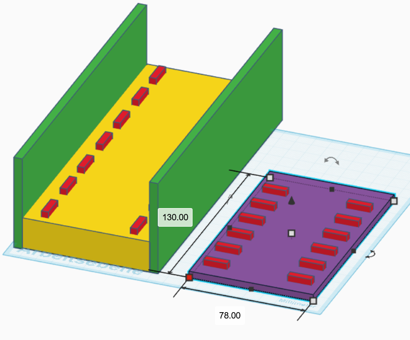

# Magnetschwebebahn

Idee nach http://www.supermagnete.de/Magnetanwendungen/Schwebender-Zug-Modell

**Benötigte Werkzeuge:** Säge, Schleifpapier (120er Körnung), Lineal, Bleistift

| Material | Preis |
|----------|-------|
| 45× Quadermagnete 15 × 4 × 4 mm, Neodym N45M, ca. 1,7 kg Haftkraft – [Q-15-04-04-MN](https://www.supermagnete.de/eng/block-magnets-neodymium/block-magnet-15mm-4mm-4mm_Q-15-04-04-MN) | 31,50 € |
| 1× Rechteckleiste Kiefer 900 × 70 × 10 mm – [Hornbach Art. 5490987](https://www.hornbach.de/p/rechteckleiste-kiefer-900x70x10-mm/5490987/) | 4,70 € |
| 1× Rechteckleiste Kiefer 2000 × 60 × 5 mm – [Hornbach Art. 5485733](https://www.hornbach.de/p/rechteckleiste-kiefer-2000x60x5-mm/5485733/) | 5,85 € |
| 1× Rechteckleiste Kiefer/Fichte 2000 × 80 × 20 mm – [Hornbach Art. 5485741](https://www.hornbach.de/p/rechteckleiste-kiefer-fichte-2000x80x20-mm/5485741/) | 16,95 € |
| 1× DIN A4 Bastelsperrholz Pappel (5 St.) – [Hornbach Art. 3841377](https://www.hornbach.de/p/bastelsperrholz-pappel-din-a4-5-stueck/3841377/) | 3,45 € |
| Ponal Classic Holzleim 760 g – [Hornbach Art. 2540343](https://www.hornbach.de/p/ponal-classic-holzleim-760-g/2540343/) | 9,75 € |
| **Gesamt** | **72,20 €** |
## 1. Holz zuschneiden

- **Fahrzeug (lila):** 130 mm von der 60 × 5 mm Leiste, im Bild auf dem Kopf liegend.
- **Fahrbahn (gelb):** Leiste 80 × 20 mm
- **2× Seitenbegrenzung (grün):** Leiste 70 × 10 mm
- **2× Prellböcke (nicht eingezeichnet):** je 90 mm von der 70 × 10 mm Leiste

## 2. Kanten schleifen

Schleife alle Holzteile gründlich ab, besonders die frisch gesägten Kanten.

## 3. Magnetpositionen markieren

Der Abstand zwischen den Magneten beträgt vermutlich etwa 20–25 mm (Mitte zu Mitte).
Zeichne mit Bleistift und Lineal die Positionen der Magnete auf. Wer Zugang zu einem Lasercutter hat, kann kleine Vertiefungen (4 × 4 mm, ca. 2 mm tief) in die Holzteile lasern.

## 4. Magnete befestigen

Teste zunächst die Polarität der Magnete mit einem bereits festgeklebten Magnet.

## 5. Seitenteile montieren

Verleime mit Holzleim die beiden Seitenbegrenzungen seitlich an die Fahrbahn, sodass ein U-förmiges Profil entsteht. Anschließend die beiden Prellböcke an die kurzen Enden der Fahrbahn kleben.
Danach 24 Stunden trocknen lassen.

